# NutriBlend Mobile Application

A premium mobile application built with Flutter, designed for seamless health, wellness, and pharmaceutical product discovery and shopping. NutriBlend features a clean, modular user interface, smooth animations, and a persistent navigation shell for a fluid user experience.

---

## 🎨 Theme & Design Guidelines (Source of Truth)

To maintain a consistent UI/UX across all screens and prevent layout fragmentation, all developers must strictly adhere to the following style guide. Do not hardcode custom hex codes or fonts outside of these definitions.

### 🔑 Color Palette

| Usage | Hex Code | Visual Sample | Application |
| :--- | :--- | :--- | :--- |
| **Primary / Brand** | `#000435` | 🟦 Dark Navy | Active Bottom Nav, Primary Buttons, Price Tags, Selection Highlights |
| **Secondary Accent**| `#0EA5E9` | 🔷 Light Sky Blue | Hyperlinks, Secondary CTA ("See More" link text) |
| **Dark Neutral** | `#1E293B` | ⬛ Deep Slate | Primary Headings, Product Names, Heavy Body Text |
| **Medium Neutral** | `#64748B` | ⬜ Cool Grey | Form Placeholders, Secondary Descriptions, Pagination Text |
| **Light Background**| `#F8FAFC` | ⬜ Off-White | Scaffold Background, Product Card Backdrops, Search Bar Fill |

### 🔤 Typography & Font Hierarchy

We utilize **Google Fonts** via the `google_fonts` package. 

* **Headings & Titles:** `GoogleFonts.poppins()` (Weight: `FontWeight.w600` or `w700`)
* **Body Text & UI Labels:** `GoogleFonts.inter()` (Weight: `FontWeight.w400` or `w500`)

#### Global Text Style Definitions (in `ThemeData`):
* **Screen Titles (AppBar):** Poppins, Size `20`, Bold (`w600`), Color: `Dark Neutral`
* **Product Card Titles:** Poppins, Size `16`, Semi-Bold (`w500`), Color: `Dark Neutral`
* **Price Tags:** Inter, Size `16`, Bold (`w700`), Color: `Primary (#000435)`
* **Body Description:** Inter, Size `14`, Regular (`w400`), Color: `Medium Neutral`

---

## 📱 Application Flow & Navigation Architecture

The application implements a persistent navigation shell (`MainNavigationScreen`) that hosts the core tabs using an `IndexedStack` to preserve state (like scroll position and page offsets) as the user navigates.

```
          [Splash Screen] 
                 │
                 ▼
        [Onboarding Screens]
                 │
                 ▼
      [Login / Register Screens]
                 │
                 ▼
    [Main Navigation Shell (Persistent bottom bar)]
     ├── Tab 0: [Dashboard / Home Page]
     ├── Tab 1: [Product Catalog Page] (2x3 Grid + Pagination)
     ├── Tab 2: [Wishlist Screen]
     └── Tab 3: [Profile Page]
           │
           ├─► [Order History / Settings / Help / About]
           │
     [Product Card Click] ──► [Product Details] ──► [Add to Cart] ──► [Checkout / Cart]
```

### Flow Breakdown:
1. **Entry:** User boots into the **Splash Screen** and slides through the **Onboarding Screens**.
2. **Authentication:** User logs in or registers via the **Login/Register Screens**.
3. **Core Shell:** Once authenticated, the user lands on the **Main Navigation Shell**, which houses the persistent bottom navigation bar.
4. **Dashboard (Home):** Tab 0 displays category quick-links, promo banners, and horizontal lists of featured products and best sellers.
5. **Product Catalog:** Tab 1 displays all available products in a clean grid with search filtering and page pagination.
6. **Wishlist:** Tab 2 allows users to view favorited items, add them directly to the cart, or remove them.
7. **Profile & Settings:** Tab 3 manages user settings, order history, and logging out.
8. **Checkout:** Deep-dive details (like product details, cart, and checkout) are pushed on top of the shell stack, hiding the navigation bar when active.

---

## 📦 Screen & Layout Architecture

### 1. Entry & Auth Phase
* **Splash Screen (`splash_screen.dart`)**: Displays NutriBlend branding with a loading spinner and handles auto-login routing.
* **Onboarding Screen (`onboarding_screen.dart`)**: Multi-step introductory view with slide illustrations and skip/next actions.
* **Login & Register Screens (`login_screen.dart`, `register_screen.dart`)**: Sleek form validation layouts connected to authentication services.

### 2. Main Hubs (Hosted inside `MainNavigationScreen`)
* **Dashboard / Home (`home_screen.dart`)**: 
  * Unified top header with logo, title, notifications, and cart shortcut.
  * **Hero Carousel:** Auto-sliding banner carousel showing current campaigns.
  * **Quick Categories:** Grid shortcuts to find skincare, supplements, Hair Care, vitamins, etc.
  * **Horizontal Product Rows:** Showcases of "Featured Products" and "Best Sellers".
* **Product Catalog Page (`products_screen.dart`)**:
  * Grid layout showing products with search query filters.
  * **Pagination Controls:** Bullet indicator showing the current page of products.
* **Wishlist Screen (`wishlist_screen.dart`)**:
  * Shows favorited items. Can be viewed as a tab (no back button) or pushed standalone (shows back button).
* **Profile Page (`profile.dart`)**:
  * Displays user profile details, order history link, settings, help center, and logout action.

### 3. Detail & Purchase Phase
* **Product Details (`product_detail_screen.dart`)**: Immersive view of a product with price, description, rating details, and a primary **Add to Cart** action.
* **Cart Page (`cart_screen.dart`)**: Manages items added to cart, quantity adjustments, and total calculations.
* **Checkout Page (`checkout_screen.dart`)**: Static-functional view to capture shipping info, order summary, and submit payment.
* **Order Confirmation (`order_confirmation_screen.dart`)**: Success state displaying order tracking details.

---


## 🛠️ Setup & Technical Guidelines

* **Framework:** Flutter / Dart
* **Architecture Style:** Feature-first modular structure.
* **Global State Management:** Managed using **Provider** for clean reactive updates:
  * `AuthProvider`: Handles session storage, registration, login, and logging out.
  * `ProductProvider`: Fetches products from services, handles loading state, and detail selection.
  * `CartProvider`: Manages the local shopping cart, sums quantities, and item totals.
  * `WishlistProvider`: Manages the user's liked products list.
  * `NavigationProvider`: Controls the active index of the persistent shell bottom bar.

### Getting Started
1. Clone the repository.
2. Run `flutter pub get` to install dependencies.
3. Launch with `flutter run` on your preferred emulator or device.

## Screenshots
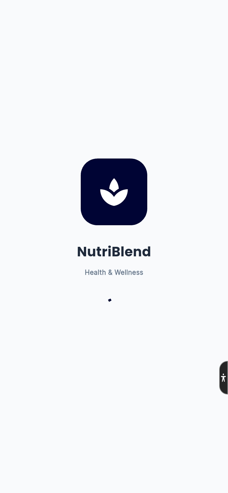
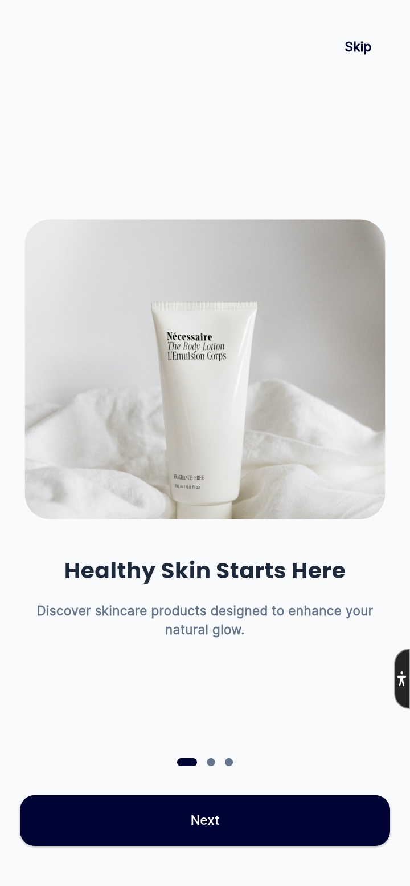
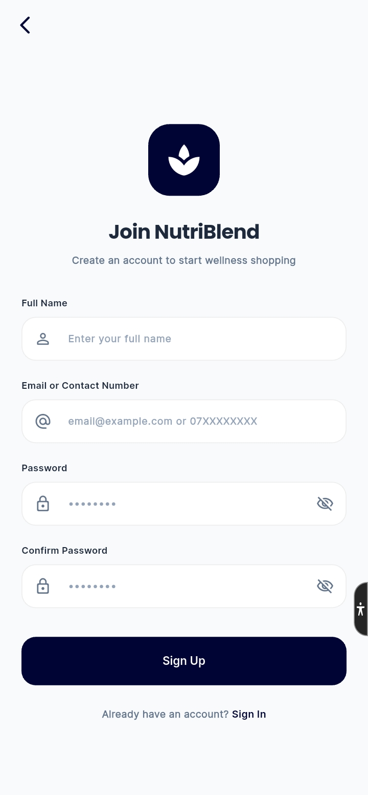
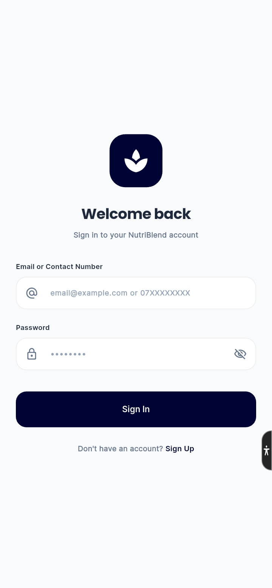
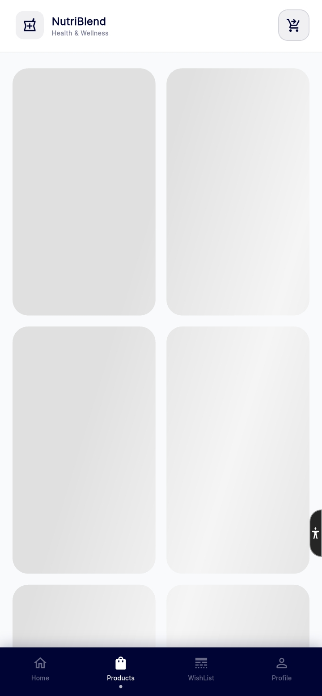
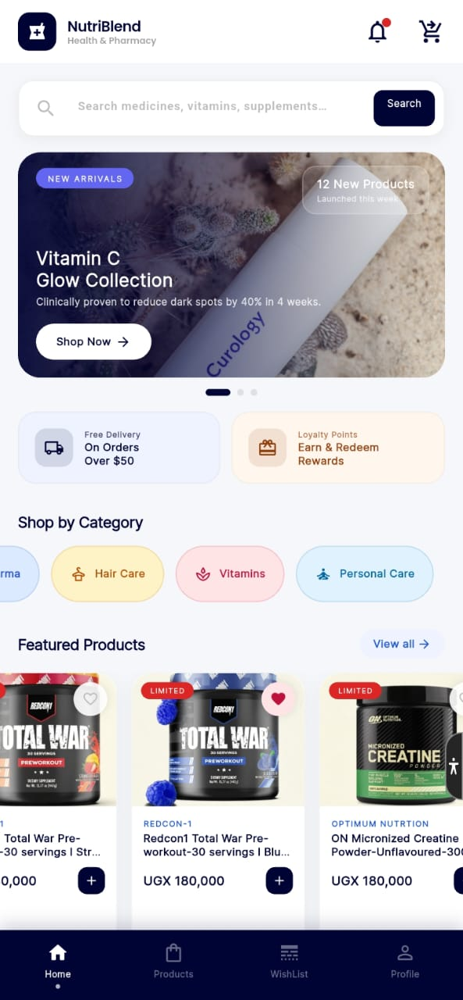
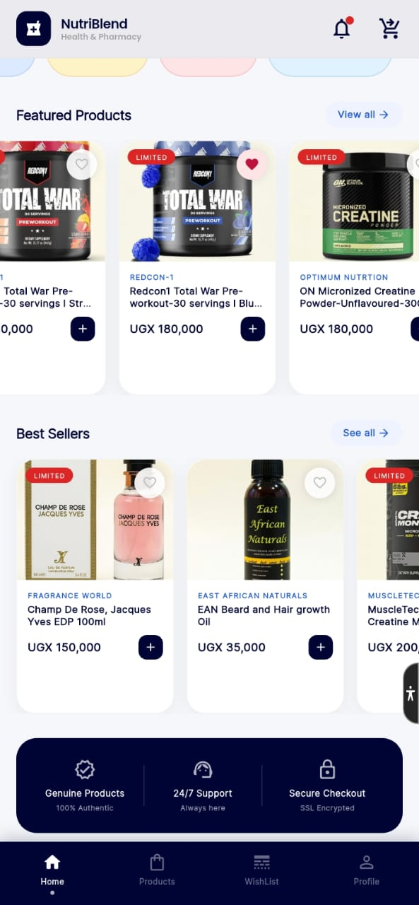
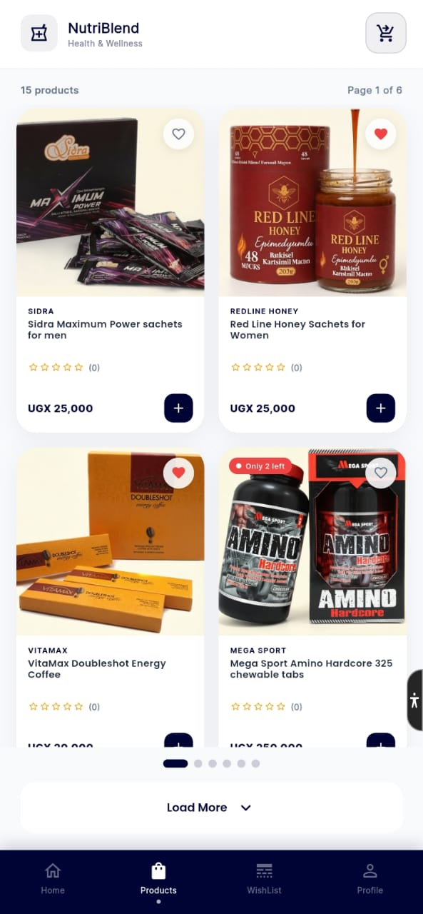
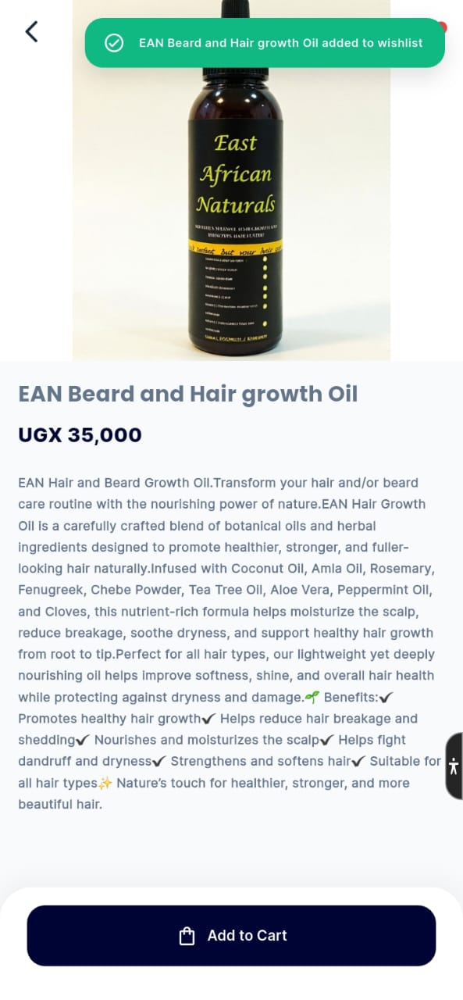
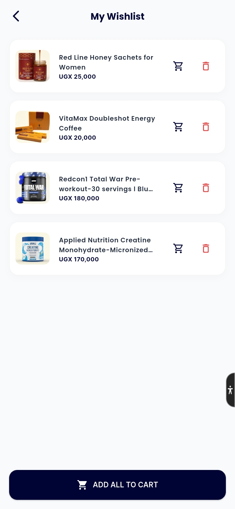
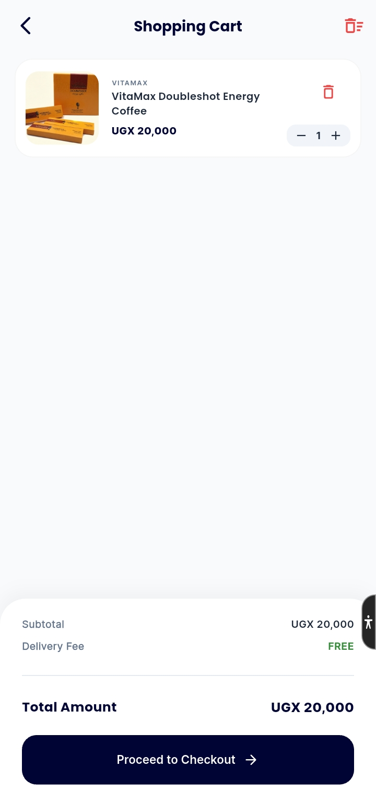
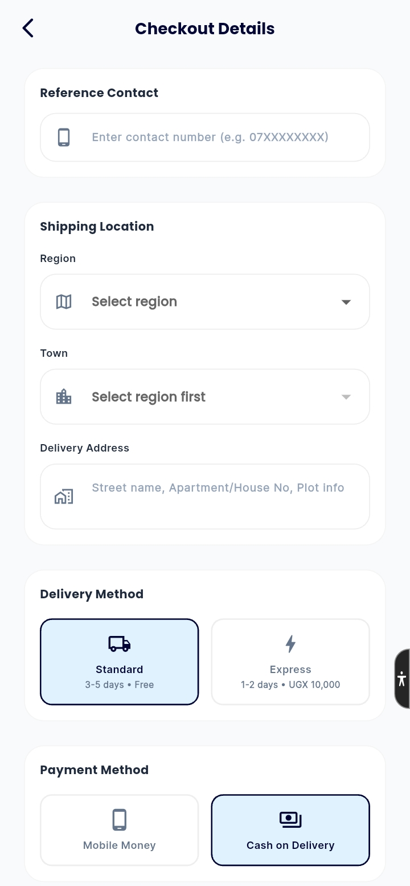
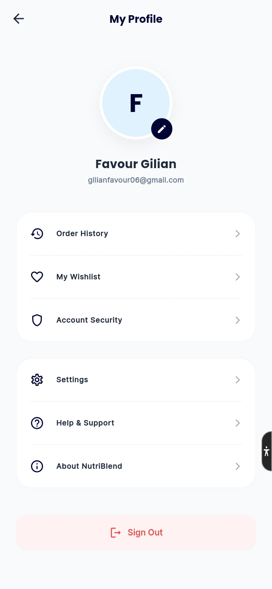
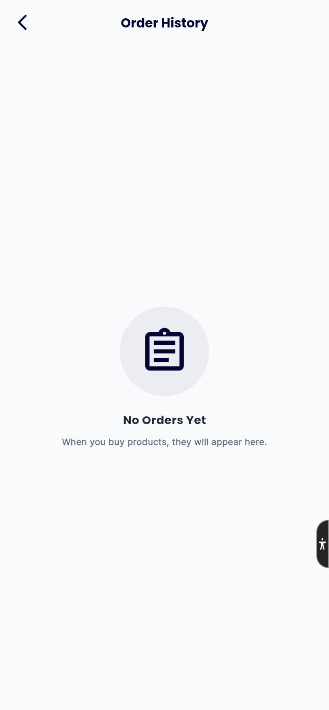
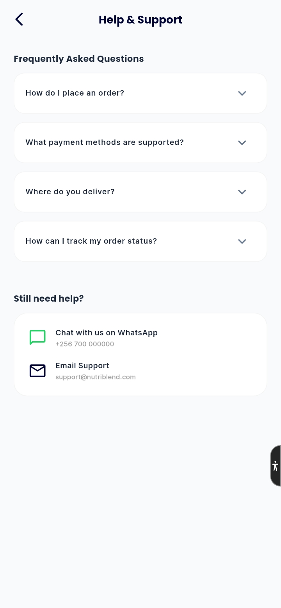
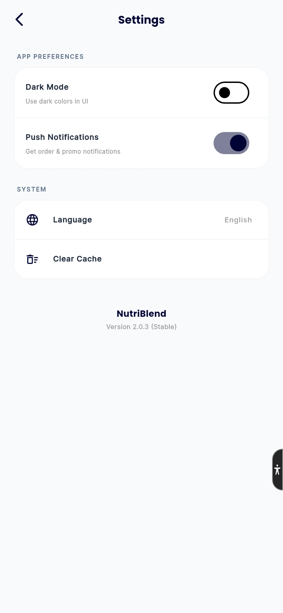
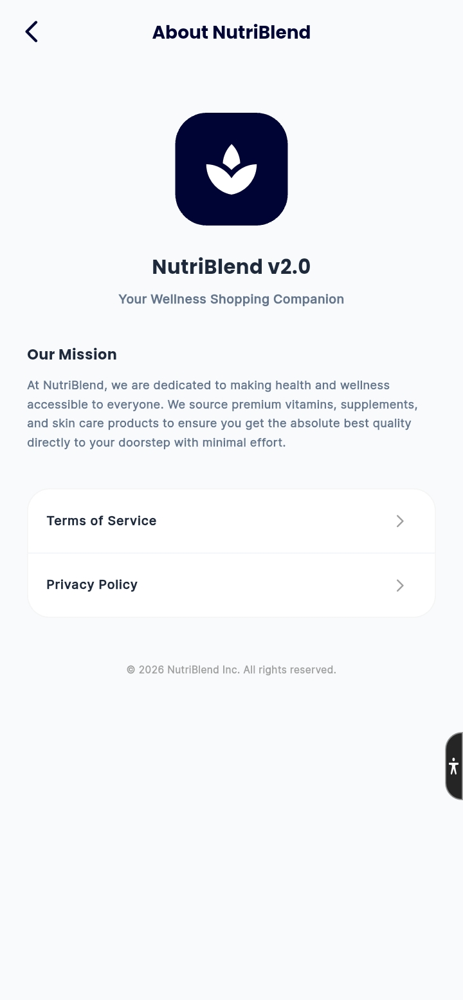
